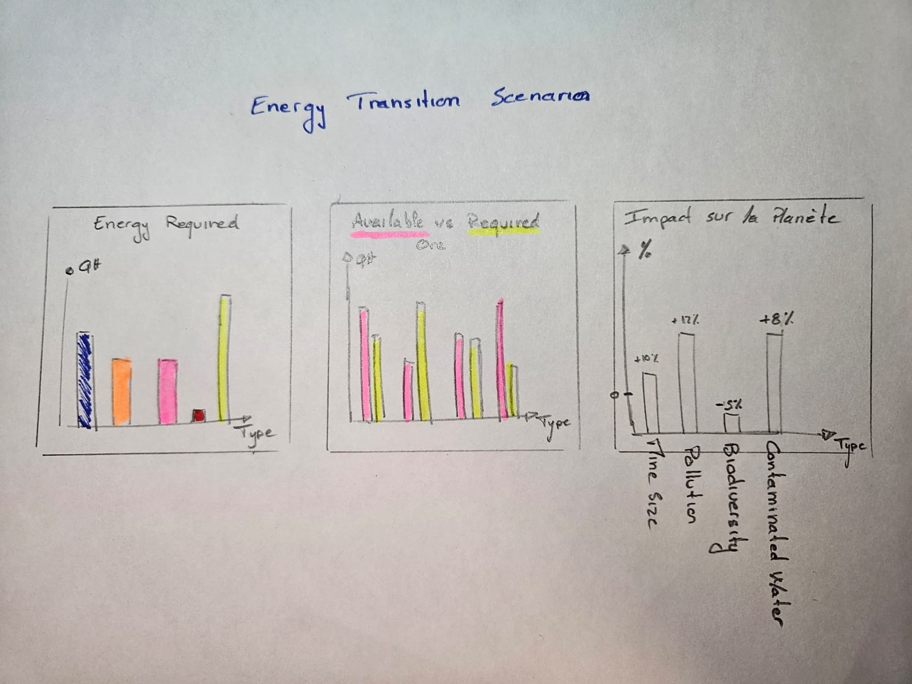

**
MILESTONE 2
**
**
Project of Data Visualization
**
**
Alexandre Maillard
**

**Objectives of the project:**

The main goal of this project is to understand what an energy transition means from the point of view of minerals. Nobody really cares about mining and the impact it can have on our planet. With these visualizations, I want to try and show in a simple and comprehensive way what's at stake in this transition.

**Project Structure:**

The project follows a guideline from global warming to mineral extraction. The idea is to start from the bottom and go deeper and deeper.
Everything will take place on the same globe throughout the exploration, with different layers being added or removed as you go along.  

1. **Energy and Global Warming**

This graph shows a globe with average temperatures by country to illustrate global warming over the years. Clicking on a country also shows its energy production and consumption.

	

- Tools:
- Lecture:

2. **Renewable Energy**

Continuing with our idea of the globe that forms the basis of each graph, here we'll be able to select the renewable energy of our choice to visualize where it's produced and which countries produce the most, as well as additional graphs showing the evolution of production and the minerals needed to make it.

- Tools: 
	- Lecture:

3. **Minerals Extraction**

The aim is to visualize the different mines on the map with their different characteristics, enabling us to see the impact of extraction and the location of resources, and to understand what is at stake in the transition.

- Tools: 
	- Lecture:

4. **Energy transition scenario**

Finally, we'll take a look at a possible energy transition scenario and consider what this would mean for minerals and the planet.

- Tools: 
	- Lecture:

**Additional idea** (time-dependent): 
- Extend to other scenarios 
- Add other possible impacts (visualize import/export routes and the pollution generated, look at the impact on the landscape of the expansion of the mines needed for such large-scale production (size, etc.).

